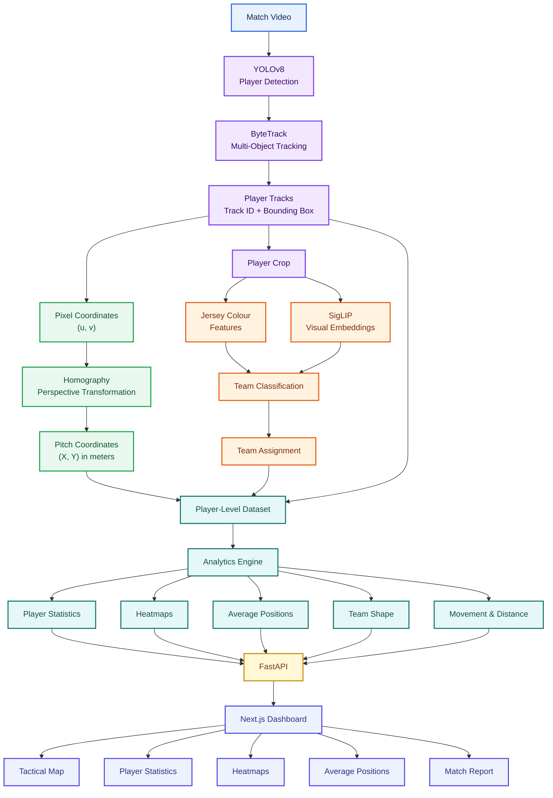

# TacticEye

Football match video in, tactical analytics out. TacticEye detects and tracks every player in a broadcast-style clip, maps them onto the pitch, splits them into teams, and serves the result through an API to a web dashboard (tactical map replay, player stats, heatmaps, match report).

## System Architecture



## Requirements

- Python 3.10+
- Node.js 18.18+

## Quick Start

### Backend

```bash
cd backend
python -m venv venv
venv\Scripts\activate
pip install -r requirements.txt
uvicorn app.main:app --reload
```

API: `http://127.0.0.1:8000/docs`

### Frontend

Open a second terminal:

```bash
cd frontend
cp .env.local.example .env.local
# Windows:
# copy .env.local.example .env.local

npm install
npm run dev
```

Open `http://localhost:3000`.

Press **Play** on the tactical map to replay the clip.

The API serves the files in `backend/data/demo/`. Point it at another match with `MATCH_DIR=/path/to/output`.

If required, set `FPS=25`. By default, FPS is read from `team_stats.json`.

## Dashboard

- **Stats cards:** clip length, frames, tracks, distance per team.
- **Tactical map:** bird's-eye replay of player positions with play/pause, scrubber, speed, team filter and trails.
- **Players table:** distance, average speed and time seen per track.
- **Heatmaps:** player distribution for each team.
- **Average positions:** team-level positioning analysis.
- **Match report:** HTML match report embedded in the dashboard.

## API

Pitch coordinates are measured in metres with the origin at the top-left (`x = length`, `y = width`).

Interactive API documentation is available at `/docs`.

| Endpoint | Returns |
|---|---|
| `GET /health` | API status |
| `GET /api/summary` | FPS, frame range, clip length, track count, team names, coordinate bounds and team statistics |
| `GET /api/frames/{n}` | All players in frame `n` |
| `GET /api/tracks?start&end&team` | Track data for a frame range |
| `GET /api/players` | Per-track distance and average speed |
| `GET /api/heatmap/{team}` | PNG heatmap |
| `GET /api/avg-positions` | PNG average-position visualization |
| `GET /api/report` | HTML match report |

### Testing

```bash
cd backend
pip install -r requirements-dev.txt
python -m pytest
```

### Docker

```bash
cd backend
docker build -t tacticeye-api .
docker run -p 8000:8000 tacticeye-api
```

## Running the CV Pipeline on Your Own Clip

Install the CV dependencies:

```bash
pip install -r requirements.txt
```

Run player detection and tracking:

```bash
python track.py \
    --video sample2.mp4 \
    --model yolov8m.pt \
    --imgsz 1280 \
    --conf 0.15 \
    --out output4
```

Convert pixel coordinates to pitch coordinates using the homography pipeline:

```text
src/apply_homography.py
→ tracks_pitch.csv
```

Generate the dashboard demo data:

```bash
cd backend
python tools/make_demo_data.py \
    --tracks ../tracks_pitch.csv \
    --video ../sample2.mp4 \
    --out data/demo
```

`tools/make_demo_data.py` splits teams using median shirt colour with K-means (`k=2`), filters very dark kits such as referee/keeper detections, and generates:

- `tracks_roles.csv`
- `team_stats.json`
- Heatmaps
- Average-position visualizations
- Match report

### Performance Tips

- `yolov8n.pt` is the fastest option but may miss players in wide broadcast shots.
- `yolov8m.pt` with `--imgsz 1280` provides substantially better player detection.
- Use `--every_n 6` for a quick trial run when testing the pipeline.

## Known Limitations

- **Partial pitch calibration:** The current homography is fitted using four points in one penalty-box region, so extrapolation to the rest of the pitch is inaccurate. Full-pitch calibration requires additional spread-out landmarks such as the centre circle, halfway line and both penalty boxes.
- **Detection density depends on the model:** Smaller models such as `yolov8n` may produce sparse player detections. Larger models provide better coverage at the cost of inference speed.
- **Roles:** The current demo assigns a generic `player` role. Role detection is not yet integrated into the API.
- **Ball tracking:** Ball tracking, passing lanes and expected threat (`xT`) are not implemented yet.
- **API:** The current API is read-only and does not yet provide a video-upload endpoint.

